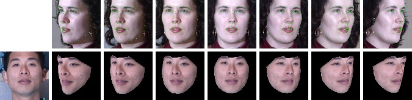

# FaceWarper

FaceWarper is an OpenGL program that uses the results from DepthNet to apply a 3D affine transform (warp) to a source face image (shown on left) to rotate it to the target face geometry and pose (shown on top).

<p align="center">
  
</p>

FaceWarper uses a client-server architecture. The server, FaceWarperServer, is programed in C++11. A reference Python implementation of a client, FaceWarperClient, is provided. Finally, the Python script "warp_dataset.py" is provided to apply the 3D affine transforms inferred by DepthNet on a full dataset.

## Usage with DepthNet
You first need to build FaceWarperServer in order to use it. Detailed instructions on how to build it is provided in the section below.

Then, with the results obtained from running DepthNet (affine transforms, 2D keypoints and depths), run the Python script "warp_dataset.py" to generate warped faces. The following figure gives an overview of how FaceWarper works. DepthNet previously found the face 2D keypoints and their depth in the source image, and computed the affine transform to warp the source image into the pose of the target image. The target itself is not used by FaceWarper, it is presented in the figure only to better understand the result.


Run "warp_dataset.py" as follows:

```
python warp_dataset.py --results "/path/to/results" --server_exec "./FaceWarperServer/build/FaceWarperServer" "/path/to/dataset"
```
Where ```/path/to/results``` is the path you want the warped faces to be saved to and ```/path/to/dataset``` is the path to the dataset. This dataset must contain the results generated by DepthNet. The dataset structure and its content is described in a section below.

### Testing
To make sure your setup is working as expected, run the command in Linux 
```
python warp_dataset.py --results "results" --server_exec "FaceWarperServer/build/FaceWarperServer" "dataset_example"
```
or in Windows
```
py warp_dataset.py --results "results" --server_exec "FaceWarperServer\binaries\windows\FaceWarperServer.exe" "dataset_example"
```
The program should run without generating any errors. The images generated in the created directory ```results``` should be identical to the images provided in ```dataset_example/expected_result```.

## FaceWarperServer
FaceWarperServer is a C++11 application that applies a 3D affine transform to a mesh. It acts as a server that listens on the standard input. A visualization window is shown on the desktop. The image in this window is scaled to ease visualization, but the processing is done at the source texture resolution.

The server supports Linux and Windows.

### Dependencies
To build FaceWarperServer, the following libraries are required :
- GLEW
- freeglut
- GLM
- libpng (requires zlib)

On a Debian/Ubuntu Linux distribution, these dependencies can be installed with the following packages :
- libglew-dev
- freeglut3-dev
- libglm-dev
- libpng-dev

### Pre-built binaries
Pre-built binaries for Windows are provided in the "/FaceWarperServer/binaries/Windows" folder. The binaries have been tested on Windows 10 (version 1803), but should work with previous versions of Windows.

### Build
A CMake CMakeLists.txt is provided to build FaceWarperServer. <br />
To build on **Linux**, the helper shell script "build_linux.sh" is provided. <br />
To build on **Windows**, the helper Batch script "build_windows.bat" is provided. It supposes that the required libraries are located in "FaceWarperServer\lib" directory.

If you have problems building with CMake on Windows, a Visual Studio 2017 project is also provided in the "windows_build" directory.

If one of the dependencies can't be found by CMake, use the "-DCMAKE_PREFIX_PATH=" option to tell CMake where to find them. For example, if CMake can't find GLEW :
```
cmake -DCMAKE_PREFIX_PATH="/path/to/glew/glew-2.1.0/build/" ..
```

## warp_dataset.py
The Python program "warp_dataset.py" launches FaceWarperServer and sequentially sends each face in the dataset to be warped.

### Dataset structure
The output directory of DepthNet can be directly passed to "warp_dataset.py". Some examples of the data format that should be passed to face warper is put in the ```dataset_example``` directory. If you want to build your own dataset and pass it to "warp_dataset.py", they should have the following format:

The dataset folder is assumed to contain the following subfolders :
- ```affine``` : the affine transforms.
- ```depth```  : the depth of the 2D keypoints.
- ```keypoints``` : the 2D keypoints in the source images.
- ```source``` : the source images.

All files in these subfolders are text files ending with ```.txt```, except for images in the ```source``` directory which are PNG images with extension ```.png```. 

Files inside ```affine```, ```depth```, ```keypoints``` and ```source``` are matched by name. For example, the image ```source/000001_crop.png``` matches with ```affine/000001_crop.txt```, ```depth/000001_crop.txt``` and ```keypoints/000001_crop.txt```.

#### Affine transform file format
There is one affine transform per file. The 2x4 matrix is encoded in the text file as follows:
```
m1 m2 m3 m4
m5 m6 m7 m8
```
All values are floating point.

#### Keypoints file format
Each file contains 68 2D points and represent the position of the keypoints on a single face. The 2D position of each keypoint in the source image are encoded in the text file as follows:
```
kp1_x kp1_y
kp2_x kp2_y
...
kp67_x kp67_y
kp68_x kp68_y
```
where ```kp_x``` and ```kp_y``` are respectively the X and Y position in pixels of the keypoint in the image. All values are integers.

The order of the keypoints is important. The keypoints are exected to follow the [300-W](https://ibug.doc.ic.ac.uk/resources/300-W/) challenge landmarks location, as presented in the figure below.

<p align="center">
  
</p>

#### Depth file format
Each file contains the depth of the 68 matching 2D keypoints. There is one depth per line :
```
kp1_depth
kp2_depth
...
kp67_depth
kp68_depth
```
The order of the depth entries is important, it must match the keypoints order in the corresponding 2D keypoints file. All values are floating point.

## Implementation details

### FaceWarperClient
FaceWarperClient is a Python package that manages a FaceWarperServer and sends warp commands to the server. It is used by "warp_dataset.py" to communicate with the FaceWarperServer. The package can be useful if you want to write a custom script to send commands to a FaceWarperServer instead of using the supplied "warp_dataset.py".

### Warp command format
This section presents the command format used to send warp commands to FaceWarperServer. These implementation details are not necessary if you just want to use the supplied FaceWarperClient package or the supplied execution script 'warp_dataset.py'. It is useful if you want to implement a new client.

The FaceWarperServer listens on the standard input for warping commands. Each warping command is a space delimited line containing the following information, in order:

1. source image file path
2. source 2D keypoint file path
3. source keypoint depth file path
4. affine transform file path
5. output image path

Once the server has finished processing the command, it writes "ready" on a new line on the standard output to notify the client that it is ready to receive a new warping command.
