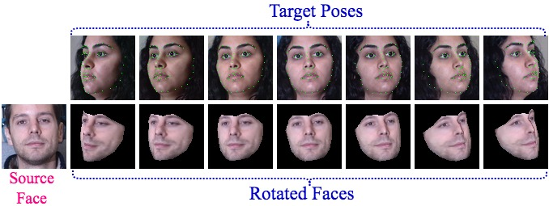
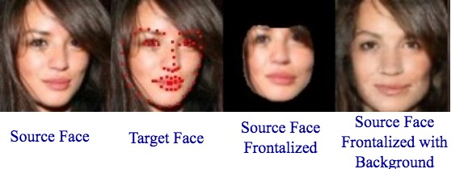
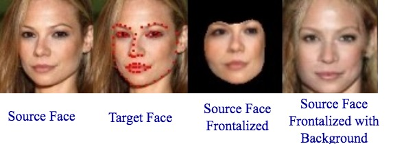
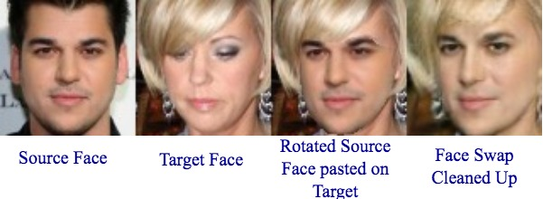
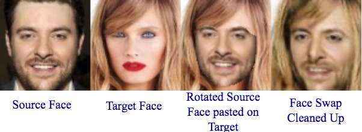
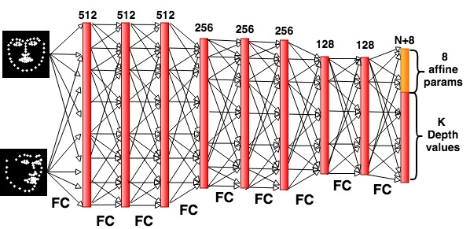

## Unsupervised Depth Estimation, 3D Face Rotation and Replacement <br /> (NeurIPS 2018)  

**Face Rotation:**
<p align="center">
   <br />
</p>

**Face Frontalization with Background Synthesis:**
<p align="center">
  
   
</p>

**Face Replecement:**
<p align="center">
   
  
</p>

This repository is split up into multiple sections, each addressing a different task in the paper. Click on the corresponding headers to be taken to those sections in this repository. Each section has a README.md file detailing how to set everything up.

If you are having issues with running the code, please do not hesitate to submit an issue.

## [DepthNets](depthnet-pytorch)

<p align="left">
  
</p>

This contains code to run DepthNet, and in particular section 3.2 of the paper ("Evaluation on unpaired faces and comparison to other models").

## [FaceWarper](FaceWarper)
Once you have trained a DepthNet model and wish to produce face warps, compile the [FaceWarper](FaceWarper) and then see section [Exporting to FaceWarper](https://github.com/joelmoniz/DepthNets/tree/master/depthnet-pytorch#exporting-to-facewarper).

<p align="left">
  
</p>

This is the OpenGL pipeline used to produce face warps based on the depths and geometry output by DepthNet.

## [CycleGAN](cyclegan)

This contains code to run the experiments detailed in section 3.3 ("Face rotation, replacement, and adversarial repair"). Note that data preparation code here is dependent on the compilation of FaceWarper.


**Background Synthesis:**
<p align="left">
  
</p>

**Face Swap:**
<p align="left">
  
</p>

## Disclaimer

We have identified that the work we have presented has the potential to be applied in a manner which could be controversial (for example, see [Deepfakes](https://en.wikipedia.org/wiki/Deepfake)). We prohibit usage of this code in malicious or deceiptful applications. We encourage usage of this work to advance research for social good. Please use this code responsibly!


## Citation

If you use this code, please cite: 

```
@incollection{NIPS2018_8181,
title = {Unsupervised Depth Estimation, 3D Face Rotation and Replacement},
author = {Moniz, Joel Ruben Antony and Beckham, Christopher and Rajotte, Simon and Honari, Sina and Pal, Chris},
booktitle = {Advances in Neural Information Processing Systems 32},
pages = {9758--9768},
year = {2018},
publisher = {Curran Associates, Inc.},
url = {https://arxiv.org/abs/1803.09202}
}
```
