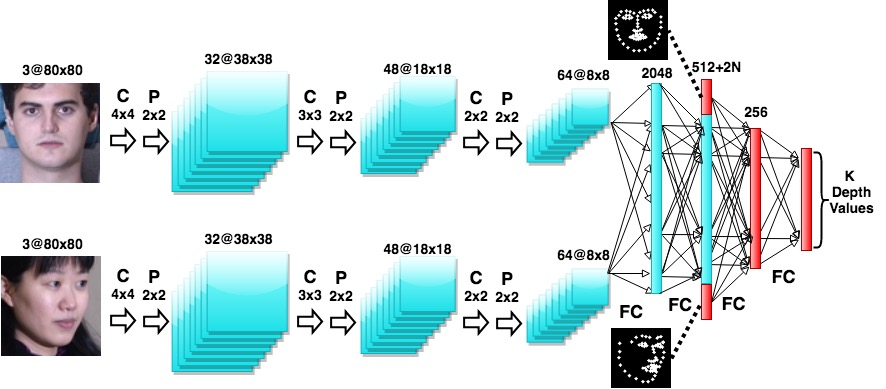
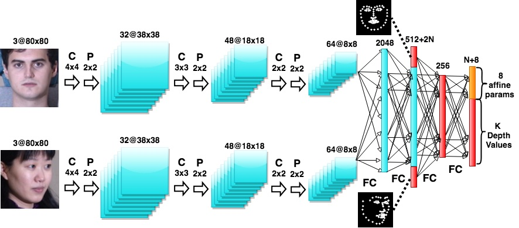

# DepthNets (in PyTorch)

This part contains the pytorch implementation of DepthNet. It contains the code for running the experiments in Section 3.2 of the paper. In particular, you can run DepthNet and DepthNet+GAN models to reproduce the results in tables 2 and 3. There is also our implementation of AIGN model for the results reported in Table 3.

You can run these variants of DepthNet:

DepthNet with pseudoinverse formulation that estimates only depth:
<p align="center">
  
</p>

DepthNet estimating both depth and affine params `m`:
<p align="center">
  
</p>


We use the 3DFAW dataset which contains 66 3D keypoints to train DepthNet models. We train on 13,671 images and validate on 4,500  images. We extract from the valid set 75 frontal, left, and right looking faces yielding a total of 225 test images, which provides a total of 50,400 source and target pairs. The DepthNet variants provided here rely on only the keypoints (not the images).

Concretely, this is the loss function we wish to minimize:

<!--  % RENDER WITH LATEXIT
\Bigg\|
\boldsymbol{x}_{t} -
%
\underbrace{\begin{bmatrix} m_1 & m_2 & m_3 & t_x \\ m_4 & m_5 & m_6 & t_y \end{bmatrix}}_{\boldsymbol{m}}
%
\left[ \begin{array}{c} \boldsymbol{x}_s \\ g(\boldsymbol{x}_s, \boldsymbol{x}_t) \\ 1 \end{array} \right] \Bigg\|^2
-->


where the left hand side is a `(2, k)` matrix (where `k` denotes the number of keypoints), `m` is a `(2, 4)` affine transformation matrix, and the ride hand side is a `(4, k)` source keypoint matrix. The DepthNet model is `g(x_s, x_t)`, which takes both the source and target keypoints, estimates the depth of the source keypoints. `m` can be found as a closed form solution, in which case DepthNet only predicts the depth of the source keypoints (top image). However, one can also use the network `g` to predict both depth and `m` (bottom image).

We also train a variant of DepthNet that applies an adversarial loss on the depth values (DepthNet+GAN).
This model uses a conditional discriminator that is conditioned on 2D keypoints and discriminates GT from estimated depth values. The model is trained with the keypoint reconstruction loss and (optionally) the adversarial loss.

## Requirements

This code has been developed and tested on Python 3.6 and PyTorch 0.4.

To quickly get setup, we can create a new Conda environment and install the required packages, like so:

```
conda env create -f=environment.yml -n depthnet
```

## Training

### Data

You will need to obtain the [3DFAW data](http://mhug.disi.unitn.it/workshop/3dfaw/) for this. You can do this by filling a data request form and sending it to the organisers of the data. When this is done, extract the zip files in some directory (provided by the organisers) so that the folders `train_lm`, `valid_lm`, `train_img`, and `valid_img` exist. Also download the [valid/test split file](https://mega.nz/#!FD5HBa7a!AZoP_TmvWaDsN5YV0coVMHU9fL166wgHoBFw5ixgdBU) and place it in the same directory.

Then, `cp env.sh.example env.sh`, modify `env.sh` to point to this 3DFAW directory, then `source env.sh`. Afterwards, run `prepare_dataset.py`, which will generate some `.npz` files.

### Experiments

* (1) `exps/exp1.lamb1.sd5.nogan.sigma0.sh`: this is the baseline experiment. This corresponds to the DepthNet pseudoinverse model that estimates only depth.
* (2) `exps/exp1.lamb1.sd5.nogan.learnm.sh`: the DepthNet model where `g()` also learns the affine params `m`.
* (3) `exps/exp1.lamb1.sd5.wgan.dnorm0.1.sigma0.sh`: (1) but GANified, with a conditional descriminator on the predicted depths.
* (4) `exp1.lamb1.sd5.wgan.dnorm0.1.learnm.sh`: (3) but with learning affine params `m`.

Once trained, the results and diagnostic files will be located in `results/<experiment_name>`. Models can be reloaded with the `--resume=<path_to_checkpoint>` flag, but since this is set to `--resume=auto` in the script, whenever the experiment is run it will try to find the latest model checkpoint and load that instead. Pre-trained model checkpoints can be found [here](https://mega.nz/#F!FHoT0KIb!09aEueFerQ0zzuJvvN5FnA).

## Evaluation

Once a model has been trained, add the `--interactive` flag to the experiment script. Instead of training the model, this will put you in a PDB debug mode. From this, one can invoke various functions to compute useful statistics based on the model, such as those shown in the paper:

* Depth correlation (called 'DepthCorr' in the paper). This computes the cross-correlation matrix between the X = inferred depths and Y = the ground truth ones and computes the trace of the matrix (the higher the trace, the better). DepthNet requires a source and target face, either of which can be in one of the three orientations (left-facing, center-facing, or right-facing). So we compute a 3x3 matrix of traces `M`, where `M[i,j]` is the trace of the correlation matrix between: X (inferred depths when mapping to orientation `j` faces using orientation `i` faces) and ground truth depths Y. To get Depth correlation run:
  * `interactive.measure_depth(net, grid=True)`
 
 
* Squared error between the target and predicted target keypoints (i.e. the above equation):
  * `interactive.measure_kp_error(net, grid=False)`
  
## Reproducing figures

To reproduce the figures like the ones shown in figures 2 and 3 of the paper, one needs to run experiments (1) and (2) in interactive mode, and invoke the line `interactive.measure_depth(net, grid=False, dump_file=some_output_file)`, which will dump an .npz file containing the depths inferred by the model. When you have both of these .npz files saved somewhere, go into the `figures` directory and run:
```
python gen_visualisations.py --depthnet_npz=path_to_depthnet_npz --depthnet_gan_npz=path_to_depthnet_gan_npz
```
This will dump some output files in the `output` folder of that directory.
