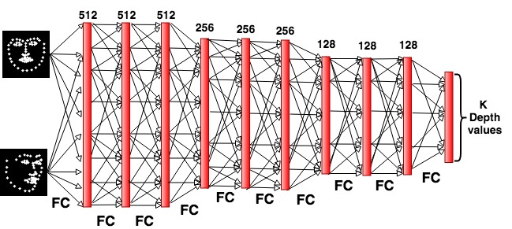
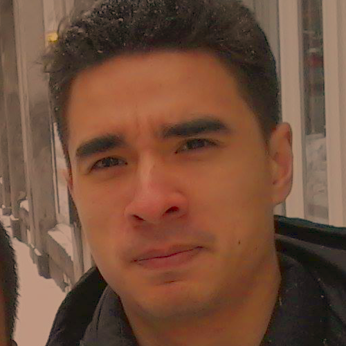
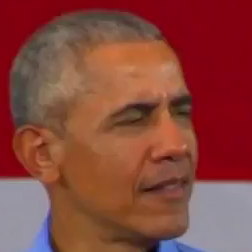
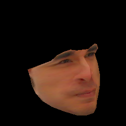
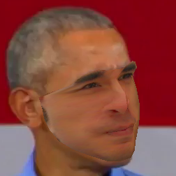
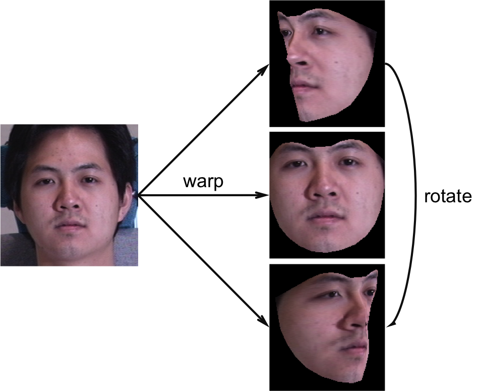
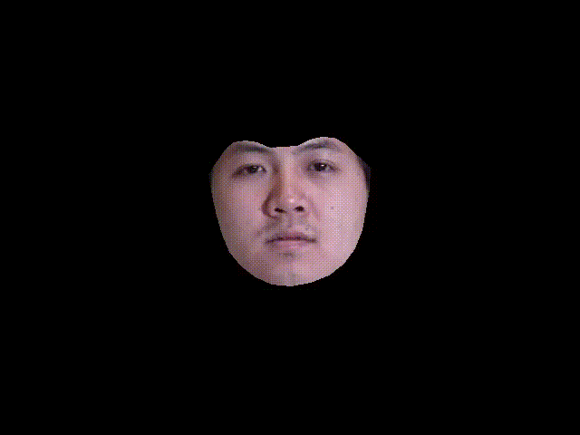
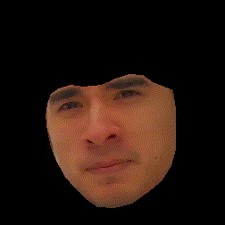

# DepthNets (in PyTorch)

This part contains the pytorch implementation of DepthNet. It contains the code for running the experiments in Section 3.2 of the paper. In particular, you can run DepthNet and DepthNet+GAN models to reproduce the results in tables 2 and 3. There is also our implementation of AIGN model for the results reported in Table 3.

You can run these variants of DepthNet:

DepthNet with pseudoinverse formulation that estimates only depth:
<p align="center">
  
</p>

DepthNet estimating both depth and affine params `m`:
<p align="center">
  
</p>


The DepthNet variants provided here rely on only the keypoints (not the images) and minimize the following loss function:

<!--  % RENDER WITH LATEXIT
\Bigg\|
\boldsymbol{x}_{t} -
%
\underbrace{\begin{bmatrix} m_1 & m_2 & m_3 & t_x \\ m_4 & m_5 & m_6 & t_y \end{bmatrix}}_{\boldsymbol{m}}
%
\left[ \begin{array}{c} \boldsymbol{x}_s \\ g(\boldsymbol{x}_s, \boldsymbol{x}_t) \\ 1 \end{array} \right] \Bigg\|^2
-->


where the left hand side is a `(2, k)` matrix (where `k` denotes the number of keypoints), `m` is a `(2, 4)` affine transformation matrix, and the right hand side is a `(4, k)` source keypoint matrix. The DepthNet model is `g(x_s, x_t)`, which takes both the source and target keypoints, estimates the depth of the source keypoints. `m` can be found as a closed form solution, in which case DepthNet only predicts the depth of the source keypoints (top image). However, one can also use the network `g` to predict both depth and `m` (bottom image).

We also train a variant of DepthNet that applies an adversarial loss on the depth values (DepthNet+GAN).
This model uses a conditional discriminator that is conditioned on 2D keypoints and discriminates GT from estimated depth values. The model is trained with the keypoint reconstruction loss and (optionally) the adversarial loss.

## Requirements

This code has been developed and tested on Python 3.6 and PyTorch 0.4.

To quickly get setup, we can create a new Conda environment and install the required packages, like so:

```
conda env create -f=environment.yml -n depthnet
```

## Training

### Data

You will need to obtain the [3DFAW data](http://mhug.disi.unitn.it/workshop/3dfaw/) which contains 66 3D keypoints. You can do this by filling a data request form and sending it to the organisers of the data. When this is done, extract the zip files in some directory (provided by the organisers) so that the folders `train_lm`, `valid_lm`, `train_img`, and `valid_img` exist. Also download the [valid/test split file](https://mega.nz/#!FD5HBa7a!AZoP_TmvWaDsN5YV0coVMHU9fL166wgHoBFw5ixgdBU) and place it in the same directory.

Then, `cp env.sh.example env.sh`, modify `env.sh` to point to this 3DFAW directory, then run `source env.sh`. Afterwards, run `prepare_dataset.py`, which will generate some `.npz` files.

### Experiments

* (1) `exps/exp1.lamb1.sd5.nogan.sigma0.fixm.sh`: this is the baseline experiment. This corresponds to the DepthNet pseudoinverse model that estimates only depth.
* (2) `exps/exp1.lamb1.sd5.nogan.learnm.sh`: the DepthNet model where DepthNet also learns the affine params `m`.
* (3) `exps/exp1.lamb1.sd5.wgan.dnorm0.1.sigma0.fixm.sh`: (1) but GANified, with a conditional descriminator on the predicted depths.
* (4) `exps/exp1.lamb1.sd5.wgan.dnorm0.1.learnm.sh`: (3) but with learning affine params `m`.
* (5) `exps_aigns/exp1_lamb100.sh`: AIGNs (Tung et al), one of the methods we compared against.

Once trained, the results and diagnostic files will be located in `results/<experiment_name>`. Models can be reloaded with the `--resume=<path_to_checkpoint>` flag, but since this is set to `--resume=auto` in the script, whenever the experiment is run it will try to find the latest model checkpoint and load that instead. 

Pre-trained models can be found here: https://mega.nz/#F!sSwiRQCL!RSSbo-5z8FYT6cJWVKYdZQ (drop this folder in the root directory of this repo!)

## Evaluation

Once a model has been trained, simply add the flag `--compute_stats` to the experiment script. Instead of training the model, this will compute the two quantitative measures (DepthCorr, and MSE between predicted and target keypoints) on both the validation and test sets. An example of this output is shown below:

```
Computing stats on validation set...
DepthCorr: 38.93904645794212
src: all, tgt: all
kp error: 6.285902712809797e-05  +/-  4.093232188744476e-05
Computing stats on test set...
DepthCorr:
	left		center		right
left	31.105821	29.850673	30.908412
center	32.039907	35.769691	35.352298
right	26.957233	27.972830	30.943845
src: all, tgt: all
kp error: 6.54138117158912e-05  +/-  4.45993193566409e-05
```

## Reproducing figures

To reproduce the figures like the ones shown in figures 2 and 3 of the paper, one needs to run experiments (1), (3), and (5) in interactive mode but add the flag `--dump_depths=<output_file>`, which will dump an .npz file containing the depths inferred by the model (note that this flag is mutually exclusive with the aforementioned `--compute_stats` flag). When you have all three of these .npz files saved somewhere, go into the `figures` directory and run:
```
python gen_visualisations.py \
--depthnet_npz=<path_to_depthnet_npz> \
--depthnet_gan_npz=<path_to_depthnet_gan_npz> \
--aign_npz=<path_to_aign_npz>
```
The outputs can be found in the `output` folder of that same directory.

--------

# Exporting to FaceWarper

This repo contains a variety of scripts which can be used to export input data for FaceWarper.

### Warping a source face to a target face
This part allows one to warp a source face to a specified target face. 

<p align="center">
     <br />
(source image, target image, warped source, warped source pasted on target)
</p>

To do so, first run `export_to_facewarper_single.py` to export DepthNet output to Facewarper. An example is shown in the directory `exps_warping/warp_example`:

```
python export_to_facewarper_single.py \
--network=architectures/depthnet_shallowd5.py \
--checkpoint=results/${NAME}/models/100.pkl \
--src_kpts_file=exps_warping/warp_example/src_keypoints.txt \
--tgt_kpts_file=exps_warping/warp_example/obama_keypoints.txt \
--src_img_file=exps_warping/warp_example/src.png \
--tgt_img_file=exps_warping/warp_example/obama.png \
--output_dir=facewarper_input/${OUT_FOLDER} \
--kpt_file_separator=' '
```

Once the data is exported, the warp can be done by running the following script (assuming the output of this script (`warp_example`) is in the same directory as Facewarper):

```
python warp_dataset.py \
--server_exec=FaceWarperServer/build/FaceWarperServer \
warp_example \
--results=warp_example/expected_result \
--use_dir=tgt_images
```

### Warping a source face to a rotating target face
This part allows you to warp a source face to a continually rotated target face. Doing this allows one to create a video of the warped source face, as shown below.

 

To do so, first run `export_anim_to_facewarper.py` to export DepthNet output to Facewarper. An example is shown in the directory `exps_warping/rotation_example/run.sh`:

```
NAME=exp1_lamb1_sd5_nogan_sigma0_fixm
rm -r input_facewarper/rotation_example
python export_anim_to_facewarper.py \
--checkpoint=results/${NAME}/models/100.pkl \
--network=architectures/depthnet_shallowd5.py \
--axis=y \
--src_kpts_file=exps_warping/rotation_example/keypoints.txt \
--tgt_kpts_file=exps_warping/rotation_example/keypoints.txt \
--src_img_file=exps_warping/rotation_example/src.png \
--tgt_img_file=exps_warping/rotation_example/src.png \
--output_dir=input_facewarper/rotation_example \
--tgt_angle_1=0.785 \
--tgt_angle_2=-0.785 \
--scale_depth=1 \
--kpt_file_separator=' '
```


Once the data is exported, the warp can be done by running the following script (assuming the output of this script (i.e., `rotation_example`) is in the same directory as FaceWarper):

```
python warp_dataset.py \
--server_exec FaceWarperServer/build/FaceWarperServer \
rotation_example/ \
--results=rotation_example/expected_result/ \
--img_override=rotation_example/source/src.png \
--use_dir=affine
```

The above script will spit out frames in the `rotation_example/expected_result` directory, which can then be converted to a video with something like ImageMagick or ffmpeg. If you have `ffmpeg`, this is a neat command you can use to convert these to an .mp4 file:

```
ffmpeg -framerate 24 -pattern_type glob -i '*.png' -c:v libx264 out.mp4
```

Shown below is the source image used and the resulting animation output by FaceWarper:

<p align="center"> </p>
